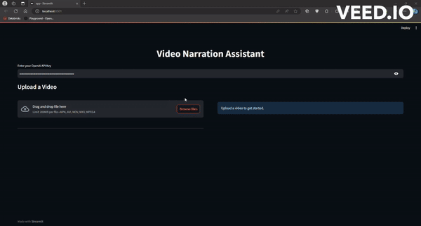

# Video Narration Assistant

This is a demo project that utilizes the advanced vision capabilities of GPT-4 to generate narrations for videos. The primary objective of this project is to provide assistance to visually impaired individuals by providing descriptive audio content for videos.



> Note: The text caption shown in the above preview is only for representation purposes. Only audio narration is generated by the app.

## Installation 

To set up the project, follow the steps below:

1. Create a new conda environment by running the following command:

    ```bash
    conda create -n llm-vision-capabilities python=3.11
    
    conda activate llm-vision-capabilities
    ```

1. Clone the project repository by executing the following command:

    ```bash
    git clone https://github.com/NoviaIntSysGroup/llm-vision-capabilities.git
    ```

1. Install the required packages by running the following command:

    ```bash
    cd llm-vision-capabilities

    pip install -r requirements.txt
    ```

## Running the App

```bash
cd src

streamlit run app.py
```

## Using the App

1. Input the OpenAI API key.
2. Upload the video file.
3. Select the parameters:
    - Max Frames: The maximum number of frames to extract from the video. This is mostly relevant for longer videos.
    - Min Frames: The minimum number of frames to extract from the video. This is mostly relevant for shorter videos.
    - Similarity Threshold: The threshold for similarity between the video frames. This is used for selecting video frames. A higher threshold means more similar frames are selected.
4. Click the 'Process Video' button.
5. You can see the selected frames in the dropdown.
6. Once you are satisfied with the selected frames based on the parameters, click the 'Generate Narration' button.
7. The narration text, along with the narrated video, will be displayed.
8. Download the narrated video by clicking the 'Download Video' button.